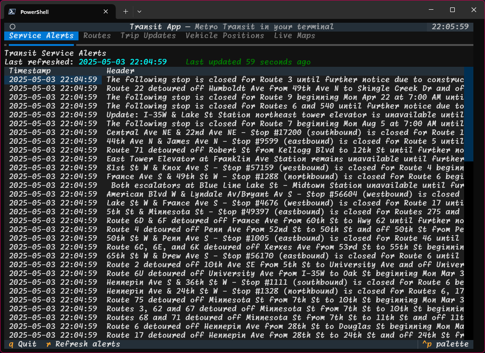
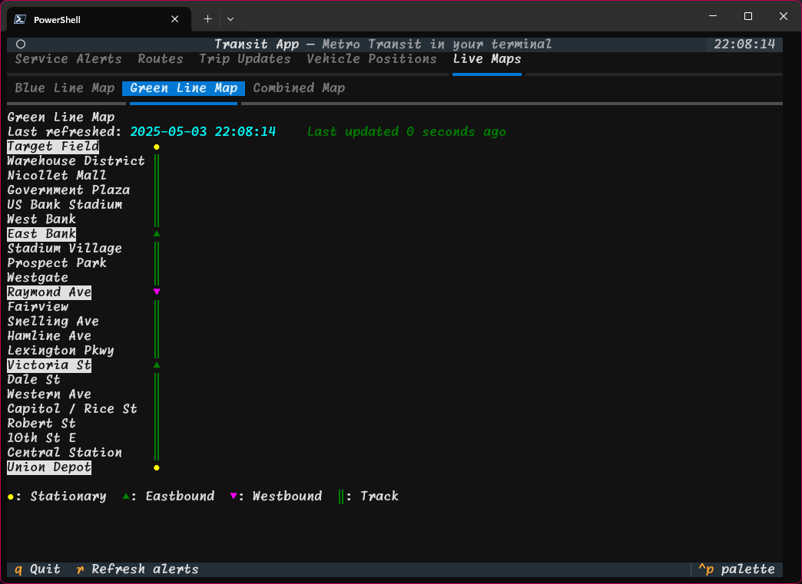

# Textual Transit

A Textual-based TUI (Text User Interface) application for displaying Metro Transit trip updates, vehicle positions, and service alerts in your terminal. It features interactive tables and real-time map tabs for the Blue and Green lines.




## Features

- View real-time Metro Transit service alerts
- See trip updates and vehicle positions
- Interactive line maps for Blue and Green lines
- Combined map view
- Status bar with last refresh time

## Installation

1. Clone this repository:

   ```sh
   git clone https://github.com/semanticdata/textual-transit.git
   cd textual-transit
   ```

2. Install dependencies (Python 3.9+ recommended):

   ```sh
   pip install -r requirements.txt
   ```

   Required packages include:

   - textual
   - requests
   - protobuf
   - google-transit-gtfs-realtime-bindings

## Usage

Run the app from the project root:

```sh
python main.py
```

## Project Structure

- `main.py`: Entry point for the application
- `src/`: Core application modules
- `src/app.py`: Main Textual app logic
- `src/metro_api.py`: Metro Transit API and GTFS utilities
- `src/status_bar.py`: Status bar widget
- `src/blue_line_map_tab.py`, `src/green_line_map_tab.py`, `src/combined_map_tab.py`: Map views

## License

MIT
